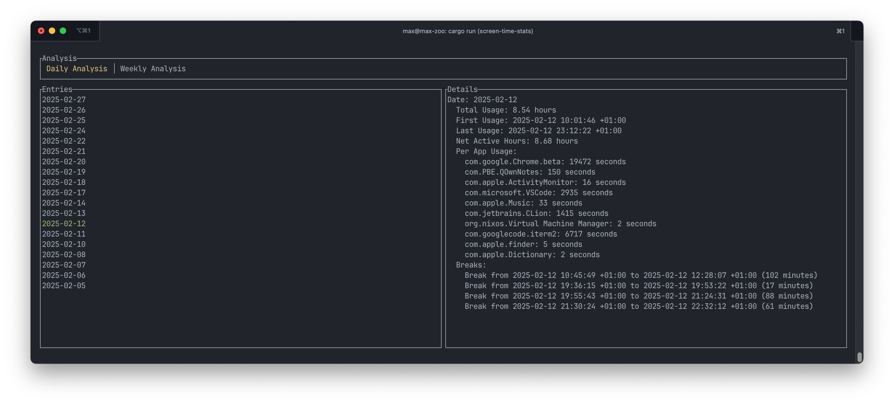

# screen-time-stats

Gathers screen time information from the Apple Screen Time database. Make sure to give your Terminal 
full-disk access in System Preferences > Security & Privacy > Privacy > Full Disk Access.

Features:
- Weekly and daily overview
- Per-app usage statistics
- Break calculation determined by 15min of no app usage
- Net Active Hours is the work time excluding breaks 

